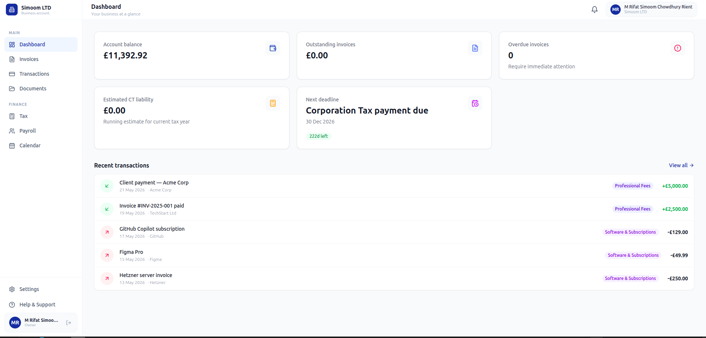
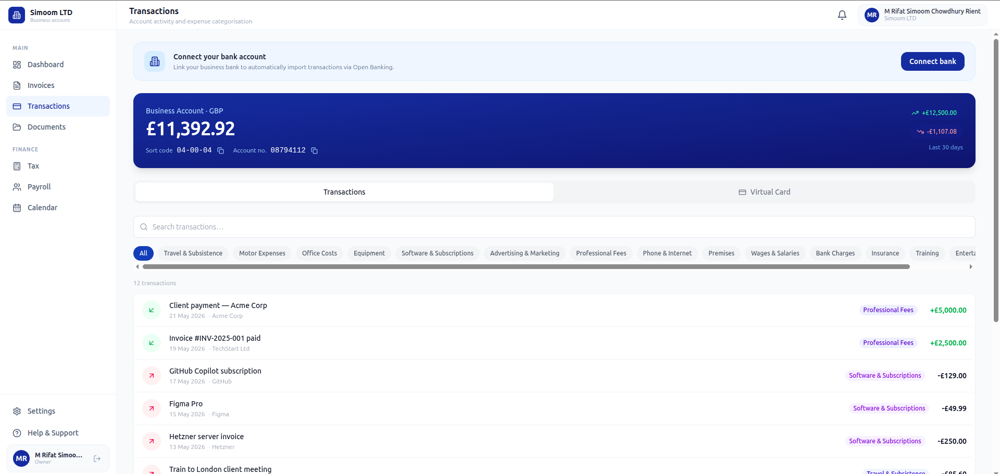
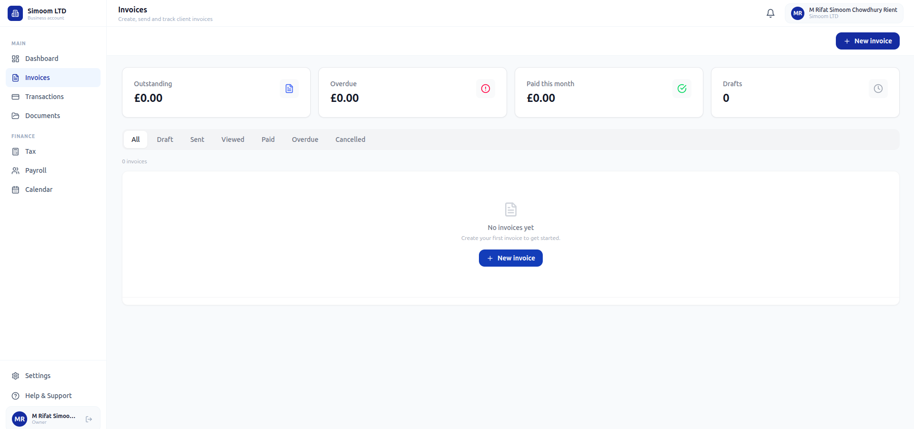
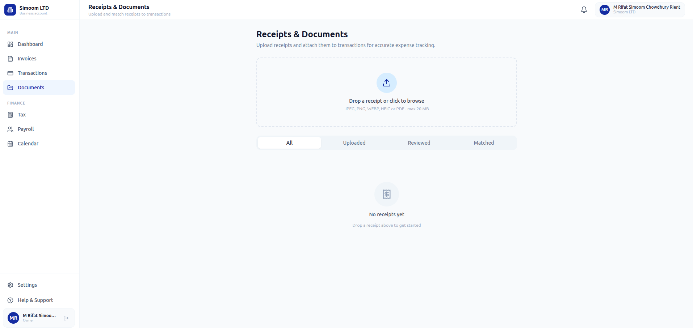
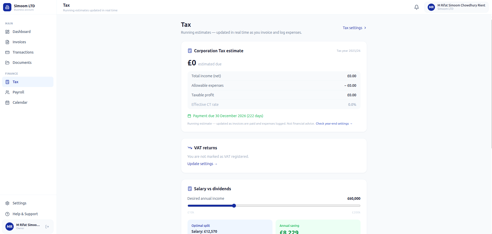

# Keel

**All-in-one business finance for UK freelancers and small companies.**

Keel replaces the spreadsheet, the invoicing website, the shoebox of receipts, and the once-a-year accountant meeting — with a single dashboard that keeps your finances current in real time.



---

## Why I built this

Every personal finance and small business app I looked at had one of three things wrong with it: a paywall, aggressive upsells, or adverts. The free tier gives you just enough to feel the pain of not upgrading. The paid tier costs more than the problem it solves. And most of them are still just a prettier spreadsheet underneath.

I kept thinking — the raw ingredients are all out there, and most of them are free to use as a developer. Banks expose their data through Open Banking APIs. Authentication is a solved problem. Document storage is cheap. Tax rules are public. So why not build the whole thing from scratch with the little knowledge I have, and see how far it goes?

That curiosity is what Keel is. A learning project that became a real product. Built because the problem is real, the tech is accessible, and it is genuinely fascinating once you start pulling on the thread.

---

## The B2B2B2B2B problem — and why TrueLayer matters

Here is something that surprised me when I started: almost nothing in fintech is built from scratch. Every layer depends on another business's infrastructure. If you trace the chain behind a simple "view your balance" feature, it looks something like this:

```
Payment networks (Faster Payments, BACS)
        ↓
Retail banks (Barclays, HSBC, Monzo...)
    — who expose transaction data under PSD2 / Open Banking regulation
        ↓
TrueLayer
    — who aggregate 100+ bank APIs into one clean, normalised API
        ↓
Keel
    — who use TrueLayer to import a user's real transactions
        ↓
The freelancer or small business owner
    — who just wants to see their balance and categorise an expense
```

That is five layers of B2B relationships before the end user sees a single number. TrueLayer's entire business is being the third link in that chain — they are B2B in the sense that they only sell to developers and businesses, never to consumers directly. But the value they create is ultimately felt by consumers. That makes them B2B2C at minimum, and more accurately B2B2B2C once you account for the fact that Keel itself is a business selling to other businesses (Ltd companies).

This is the standard shape of modern fintech. The banks could not build a great developer API even if they wanted to — it is not their core business. TrueLayer could not build a great end-user product for every possible use case — there are too many niches. So the stack fragments into specialised layers, each doing one thing well, each selling to the layer above.

What makes this interesting from a learning perspective is that TrueLayer offers a full sandbox environment — a mock bank with real OAuth flows, real account and transaction data structures, real token refresh mechanics — entirely free through their developer portal. You can build and test a complete Open Banking integration without touching a real bank account. That kind of generosity from a B2B company toward developers is rare, and it is the reason Keel's banking integration works at all.

---

## Is Keel B2B or B2C?

Technically B2B — Keel's users are limited companies and registered businesses, not private individuals. The invoices go out under a company name, the VAT returns belong to the company, the Corporation Tax estimate is a company obligation.

But behaviourally, it is much closer to B2C. A sole-director freelancer making a purchasing decision about a finance tool acts like a consumer: they evaluate it in five minutes, they care about the UI, they do not want a sales call, and they will churn the moment something feels annoying. The sales motion is self-serve, the pricing would be flat-rate subscription, and the competition is consumer apps like Monzo, Tide, and FreeAgent — not enterprise ERP systems.

The honest answer is that Keel sits in the B2SMB (business-to-small-and-medium-business) category, which inherits the worst of both worlds: the compliance complexity of selling to businesses combined with the low willingness-to-pay of consumers. That is probably why most apps in this space either have a paywall or pivot upmarket into accountancy software. Keel is an attempt to stay in that hard middle ground and make it work.

---

## What it does

| Feature | Description |
|---------|-------------|
| **Banking** | UK business account with real-time balance, HMRC-categorised transactions, virtual card, and Open Banking import via TrueLayer |
| **Invoicing** | Create, send, and track invoices — draft → sent → viewed → paid lifecycle with PDF generation |
| **Receipts & Documents** | Upload receipts (JPEG, PNG, PDF, HEIC), extract details, and link to transactions as HMRC evidence |
| **Tax** | Live Corporation Tax estimate, VAT return prep, and salary vs dividends optimiser |
| **Deadlines** | Upcoming HMRC deadlines surfaced to the dashboard so nothing gets missed |

---

## Screenshots

### Transactions & Banking


### Invoices


### Receipts & Documents


### Tax


---

## Tech stack

**Frontend**
- React 18 + TypeScript + Vite
- Tailwind CSS
- TanStack Query
- Keycloak (authentication)

**Backend — microservices (FastAPI + Python 3.12)**

| Service | Port | Responsibility |
|---------|------|----------------|
| Gateway | 8000 | Reverse proxy — routes all `/api/v1/*` requests |
| Auth | 8001 | User profiles, company settings, Keycloak integration |
| Banking | 8002 | Accounts, transactions, virtual cards, TrueLayer Open Banking |
| Invoice | 8003 | Invoice lifecycle, PDF generation, email delivery |
| Documents | 8004 | Receipt storage (MinIO/S3), transaction matching |
| Tax | 8005 | CT estimates, VAT returns, salary optimiser |
| Notifications | 8006 | In-app notifications, HMRC deadline tracking |

**Infrastructure**
- PostgreSQL 16
- Keycloak 24 (OIDC)
- RabbitMQ (outbox events)
- Redis (caching)
- MinIO (document storage)

---

## Running locally

### Prerequisites

- Docker + Docker Compose
- TrueLayer sandbox credentials (free at [console.truelayer.com](https://console.truelayer.com))

### 1. Clone and configure

```bash
git clone git@github.com:rifat-simoom/keel.git
cd keel
```

Create a `.env` file in the project root (never committed):

```env
TRUELAYER_CLIENT_ID=your-sandbox-client-id
TRUELAYER_CLIENT_SECRET=your-sandbox-client-secret
TRUELAYER_REDIRECT_URI=http://localhost:5173/banking/callback
TRUELAYER_SANDBOX=true
```

### 2. Start everything

```bash
docker compose up --build
```

| URL | Service |
|-----|---------|
| http://localhost:3000 | Web app |
| http://localhost:8280 | Keycloak admin console |
| http://localhost:9101 | MinIO console |

### 3. Log in

Default credentials (Keycloak dev realm):

- **Email:** `user@keel.dev`
- **Password:** `password`

### Connect a bank (Open Banking sandbox)

1. Go to **Transactions** and click **Connect bank**
2. You will be redirected to TrueLayer's sandbox
3. Select **Mock Bank** and log in with `john` / `doe`
4. Up to 90 days of transactions are imported automatically

---

## Project structure

```
keel/
├── backend/
│   ├── gateway/          # API gateway (FastAPI reverse proxy)
│   ├── services/
│   │   ├── auth/         # Auth service + Alembic migrations
│   │   ├── banking/      # Banking + TrueLayer integration
│   │   ├── invoice/      # Invoice service
│   │   ├── documents/    # Document storage service
│   │   ├── tax/          # Tax calculations service
│   │   └── notifications/# Notifications + deadlines service
│   └── shared/           # Shared models, auth middleware, config
├── web/                  # React frontend
│   └── src/
│       ├── pages/        # Page components
│       ├── hooks/        # React Query hooks
│       └── components/   # Shared UI components
├── packages/
│   ├── types/            # Shared TypeScript types
│   ├── api/              # Axios client
│   ├── validation/       # Zod schemas
│   └── utils/            # Shared utilities
├── infrastructure/
│   └── keycloak/         # Realm import config
└── docs/                 # Screenshots and user guide
```

---

## Roadmap

- [ ] Real bank account via Banking-as-a-Service provider
- [ ] Stripe Issuing virtual card (replace simulated card)
- [ ] AI receipt extraction (OCR → auto-fill fields)
- [ ] Payroll — PAYE calculations and payslip generation
- [ ] Mobile app (iOS + Android)
- [ ] HMRC Making Tax Digital API integration

---

## Licence

MIT — see [LICENSE](LICENSE) for details.
